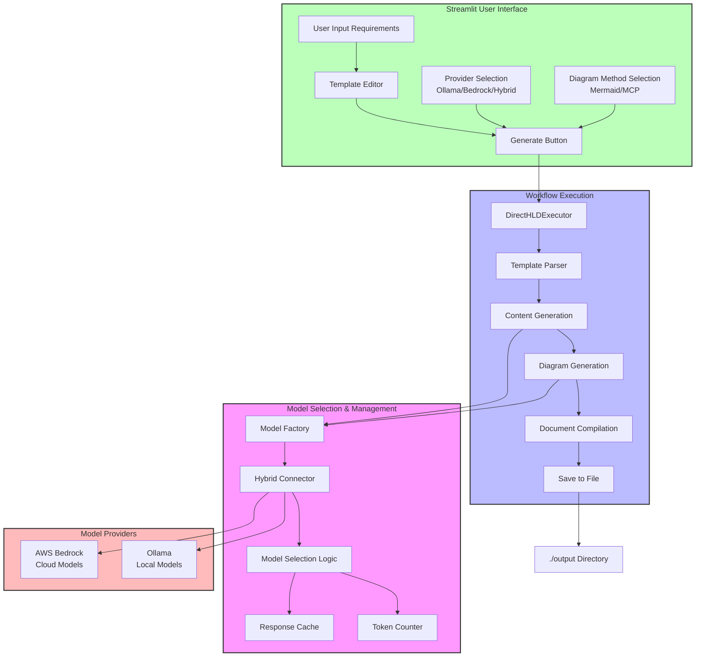

# AI-Powered High-Level Design (HLD) Generator

This project provides a tool to automatically generate High-Level Design (HLD) documents based on user requirements, leveraging Large Language Models (LLMs) and incorporating architecture diagrams. It offers flexibility by supporting both local (Ollama) and cloud-based (AWS Bedrock) LLMs, as well as different diagram generation methods (Mermaid script or AWS Diagram MCP Server).

## Features

*   **HLD Generation:** Creates structured HLD documents from user requirements using a Markdown template.
*   **Multiple AI Model Integration:**
    *   **Local LLMs** via **Ollama** (e.g., Llama 3, Mistral).
    *   **Cloud models** via **AWS Bedrock** (e.g., Claude 3, Titan).
    *   **Hybrid Model Selection** that intelligently chooses between local and cloud models based on task complexity and cost optimization.
*   **Dual Diagram Generation:**
    *   **Mermaid:** Generates Mermaid syntax directly embedded in the Markdown (default).
    *   **AWS Diagram MCP Server:** Integrates with a running instance of the AWS Diagram MCP Server for potentially richer AWS-specific diagrams (optional).
    *   Automatic fallback to Mermaid if the MCP server is unavailable or fails.
*   **Web Interface:** An intuitive UI built with **Streamlit** for configuration, input, and viewing results.
*   **Orchestration:** Uses **LangGraph** to manage the generation workflow (template parsing, content generation, diagram insertion, compilation).
*   **Customizable Templates:** Define HLD structure using Markdown templates with section headers (`##`) and diagram placeholders (`<!-- DIAGRAM: ... -->`).
*   **Efficient Token Management:** Tracks and optimizes token usage to minimize AWS Bedrock costs.
*   **Response Caching:** Avoids redundant API calls for similar requests.
*   **File Output:** Automatically saves generated HLDs to a local `./output` folder with unique filenames.
*   **Usage Statistics:** Reports on model usage and cost estimates when using hybrid mode.
*   **Configuration:** Manage API keys, endpoints, and model IDs via environment variables (`.env` file).

## Architecture

The system consists of:
1.  **Streamlit UI:** Frontend for user interaction.
2.  **Direct Executor:** Alternative to LangGraph workflow for direct execution and better state management.
3.  **Workflow Nodes:** Processing steps defined in orchestrator.py including setup, content generation, and compilation.
4.  **Model Factory & Hybrid Connector:** Selects and provides connectors for Ollama, AWS Bedrock, or intelligently switches between them based on task complexity.
5.  **Diagram Strategy:** Selects and provides generators for Mermaid or AWS MCP.
6.  **Connectors/Generators:** Modules interacting with the actual LLM APIs and diagramming tools/servers.
7.  **Template Parser:** Reads and understands the structure of the HLD template.
8.  **Document Compiler:** Assembles the final Markdown document and saves it to the output directory.


## Installation

1.  **Prerequisites:**
    *   Python 3.9+
    *   Git
    *   (Optional) Ollama installed and running: [https://ollama.com/](https://ollama.com/)
    *   (Optional) AWS Account and configured credentials for Bedrock: [https://aws.amazon.com/bedrock/](https://aws.amazon.com/bedrock/)
    *   (Optional) Deployed AWS Diagram MCP Server: [https://awslabs.github.io/mcp/servers/aws-diagram-mcp-server/](https://awslabs.github.io/mcp/servers/aws-diagram-mcp-server/)

2.  **Clone the repository:**
    ```bash
    git clone <repository-url>
    cd <repository-directory>
    ```

3.  **Create and activate a virtual environment:**
    ```bash
    python -m venv venv
    # Linux/macOS
    source venv/bin/activate
    # Windows
    # venv\Scripts\activate
    ```

4.  **Install dependencies:**
    ```bash
    pip install -r requirements.txt
    ```

5.  **Configure environment variables:**
    *   Copy `.env.example` to `.env`: `cp .env.example .env`
    *   Edit the `.env` file with your specific settings (see Configuration section below).

## AWS Bedrock Setup

To use AWS Bedrock, you'll need to set up proper IAM credentials:

1. **Create an IAM User and Policy:**
   - Sign in to the AWS Management Console and open the IAM console
   - Create a policy with permissions for `bedrock:ListFoundationModels`, `bedrock:GetFoundationModel`, and `bedrock:InvokeModel`
   - Create an IAM user with programmatic access and attach the policy
   - Save the Access Key ID and Secret Access Key securely

2. **Enable Model Access in Bedrock:**
   - Go to the Amazon Bedrock console
   - Navigate to "Model access" and request access to the models you need (Claude 3 Sonnet, Haiku, etc.)

3. **Update Your .env File:**
   ```
   AWS_ACCESS_KEY_ID=your_access_key_id
   AWS_SECRET_ACCESS_KEY=your_secret_access_key
   AWS_REGION=us-east-1  # Change as needed
   ```

For detailed step-by-step instructions, refer to the [AWS Bedrock Setup Guide](aws-setup-guide.md) included in this repository.

## Configuration (`.env` file)

*   `OLLAMA_BASE_URL`: (Optional) URL for your Ollama instance (default: `http://localhost:11434`).
*   `DEFAULT_OLLAMA_MODEL`: (Optional) Default Ollama model to use (e.g., `llama3`). Make sure you have pulled this model using `ollama pull <model_name>`.
*   `AWS_REGION`: (Optional) AWS region for Bedrock (e.g., `us-east-1`). Required if using Bedrock.
*   `AWS_ACCESS_KEY_ID`, `AWS_SECRET_ACCESS_KEY`: (Optional) AWS credentials. **Strongly recommended to use IAM roles or environment variables instead of putting keys here for production.**
*   `DEFAULT_BEDROCK_MODEL`: (Optional) Default Bedrock model ID (e.g., `anthropic.claude-3-sonnet-20240229-v1:0`). Ensure you have access granted in the Bedrock console.
*   `MCP_SERVER_URL`: (Optional) Full URL of your running AWS Diagram MCP Server instance (e.g., `http://127.0.0.1:8080`). Required only if using the 'AWS MCP' diagram option.
*   `HYBRID_STRATEGY`: (Optional) Strategy for hybrid model selection (`cost-optimized`, `quality-optimized`, or `balanced`). Default is `cost-optimized`.

## Usage

1.  **Ensure prerequisites are met:** Ollama running (if selected), AWS credentials configured (if Bedrock selected), MCP Server running (if selected).
2.  **Activate the virtual environment:** `source venv/bin/activate`
3.  **Run the Streamlit application:**
    ```bash
    streamlit run app.py
    ```
4.  **Open the provided URL** (usually `http://localhost:8501`) in your web browser.
5.  **Configure:** Use the sidebar to select the AI Model Provider (Ollama, Bedrock, or Hybrid), specific model, and Diagram Generation Method. Enter URLs/settings as needed.
6.  **Input Requirements:** Enter the high-level requirements for the system you want to design.
7.  **Review Template:** Check and modify the HLD template in the text area if needed. Ensure `## Section Title` headers and `<!-- DIAGRAM: type=... description="..." -->` placeholders are correctly formatted.
8.  **Generate:** Click the "Generate Document" button.
9.  **View & Download:** The generated HLD will appear in the main area and be automatically saved to the `./output` directory. You can also download it directly from the UI as Markdown.

## Hybrid Mode Usage

The hybrid mode intelligently selects between Ollama and Bedrock based on task complexity and cost considerations. This provides several advantages:

* **Cost Optimization:** Uses free local models for simpler tasks, reserving AWS Bedrock for complex sections.
* **Quality Control:** Ensures complex diagrams and architecture sections get the best model for the job.
* **Flexibility:** Allows you to choose different strategies based on your priorities:
  * **Cost-Optimized:** Prefers Ollama unless the task exceeds its capabilities
  * **Quality-Optimized:** Prefers Bedrock for best results, falling back to Ollama to save costs
  * **Balanced:** Makes the best choice for each section based on complexity

The hybrid mode also tracks usage statistics, allowing you to monitor the number of calls to each service and estimated costs.

## Troubleshooting

*   **Ollama Connection Error:** Ensure Ollama is running and the `OLLAMA_BASE_URL` is correct. Check firewall settings.
*   **Bedrock Access Denied/Throttling:** Verify your AWS credentials are correct and have permissions for `bedrock:InvokeModel`. Check Bedrock model access is enabled in the specified `AWS_REGION`. Be mindful of API rate limits.
*   **MCP Server Connection Error:** Ensure the MCP server is running and reachable at the specified `MCP_SERVER_URL`. Check network connectivity and server logs. The system should automatically fall back to Mermaid if the connection fails.
*   **Diagrams Not Appearing:** Ensure Mermaid syntax is correct. Check the browser's developer console for errors if diagrams render incorrectly. For MCP, check server logs.
*   **Slow Generation:** LLM inference can be time-consuming, especially for large documents or complex models.
*   **Output Files Not Saving:** Ensure the `./output` directory exists or can be created (write permissions). Check for error messages in the console.

## Token and Cost Management

The enhanced version includes several features to optimize token usage and manage costs:

* **Response Caching:** Identical prompts are cached to avoid redundant API calls
* **Task-Based Model Selection:** Different sections of the HLD are assigned to models based on complexity needs
* **Token Counting:** Tracks input/output tokens for more accurate cost estimation
* **Usage Statistics:** Reports on model usage and estimated costs in hybrid mode
* **Configurable Strategies:** Choose between cost-optimization and quality-optimization based on your needs

## Directory Structure
```
/your_project_root/
├── app.py                  # Enhanced app.py
├── hld_template.md         # Your default template
├── templates/              # Directory for additional templates
│   └── *.md                # Saved templates
├── output/                 # Generated HLD output files (created automatically)
│   └── *.md                # Markdown outputs
├── cache/                  # Persistent cache directory (created automatically)
│   └── responses/          # Model response cache files
└── core/                   # Core modules
    ├── __init__.py
    ├── config.py           # Configuration loading from .env
    ├── diagrams.py         # Diagram generation (Mermaid & MCP)
    ├── direct_executor.py  # Direct execution path bypassing LangGraph state management
    ├── models.py           # Model integrations with caching
    ├── orchestrator.py     # Defines workflow nodes and LangGraph structure
    └── templates.py        # Template parsing utilities
```
## Future Enhancements

*   Integration with other AWS MCP servers.
*   Amazon Q Developer CLI integration.
*   Context retrieval from external documentation (RAG).
*   Export to additional formats (DOCX, HTML).
*   More advanced templating (e.g., Jinja2).
*   Support for more model providers (OpenAI, Hugging Face).
*   Improved caching with persistent storage.
*   Multi-document support for creating suites of related design documents.
*   Fine-tuned model routing based on section-specific performance metrics.
